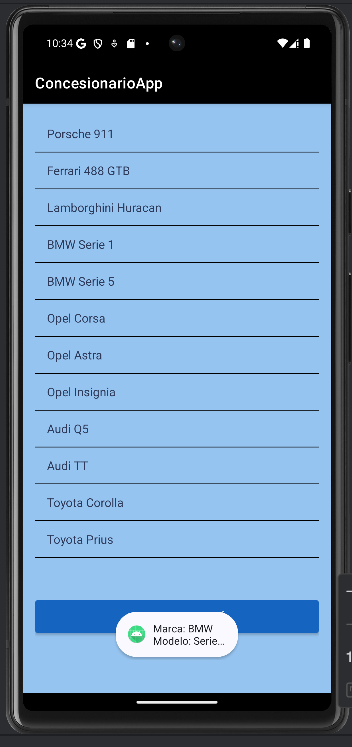
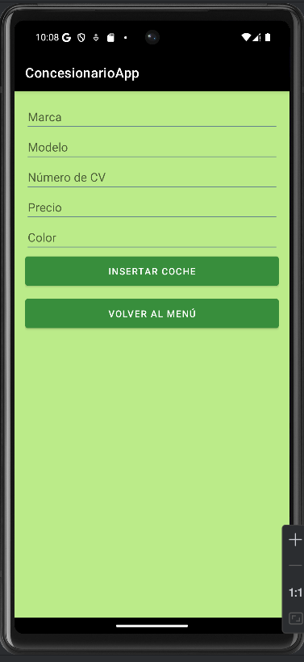
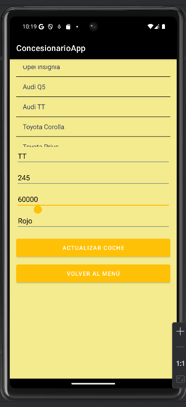
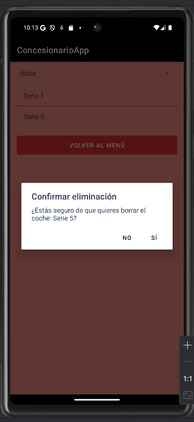

# ConcesionarioApp

Aplicación Android para la gestión del inventario de un concesionario de coches, con operaciones CRUD completas sobre una base de datos local SQLite.

## Sobre el proyecto

Aplicación desarrollada como proyecto académico durante el ciclo de Desarrollo de Aplicaciones Multiplataforma (DAM), en la asignatura de Programación Multimedia y Dispositivos Móviles. Permite gestionar el inventario de coches de un concesionario: dar de alta vehículos, consultarlos, actualizarlos y eliminarlos, todo persistido en una base de datos SQLite local.

## Funcionalidades

- Insertar: registro de nuevos coches (marca, modelo, caballos, precio, color)
- Consultar: listado completo de coches y filtrado por marca
- Actualizar: modificación de los datos de un coche existente
- Borrar: eliminación de coches por modelo, con confirmación

## Capturas de pantalla

### Consultar coches (listado y filtro por marca)


### Insertar coche


### Actualizar coche


### Confirmación de borrado


## Stack tecnológico

- Lenguaje: Java
- Plataforma: Android (Android Studio, Gradle)
- Persistencia: SQLite (mediante SQLiteOpenHelper y patrón DAO)
- UI: Material Components para Android

## Arquitectura

El proyecto separa responsabilidades siguiendo un patrón DAO sencillo:

- ConcesionarioDBHelper: creación y gestión de la base de datos
- CochesDAO: capa de acceso a datos (inserción, consulta, actualización y borrado mediante consultas parametrizadas, evitando inyección SQL)
- MainActivity: pantalla principal con navegación a cada operación
- InsertarActivity, ConsultarActivity, ActualizarActivity, BorrarActivity: una pantalla dedicada por cada operación CRUD

## Instalación y ejecución

1. Clona el repositorio:
   ```bash
   git clone https://github.com/josemompean/ConcesionarioApp.git
   ```
2. Ábrelo con Android Studio.
3. Espera a que Gradle sincronice las dependencias.
4. Ejecuta la app en un emulador o dispositivo físico.

## Licencia

Este proyecto se distribuye con fines educativos.
